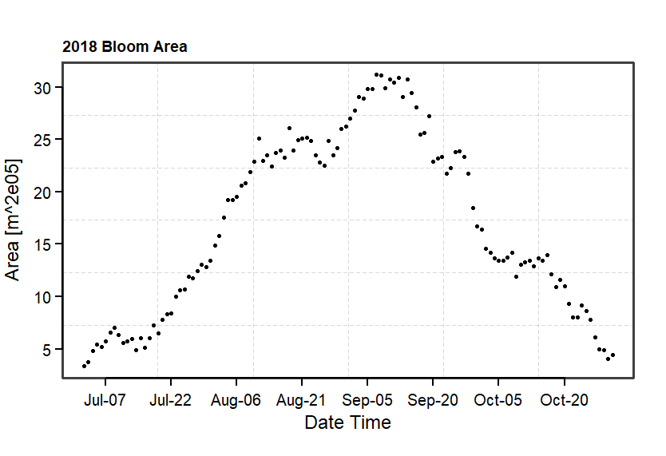
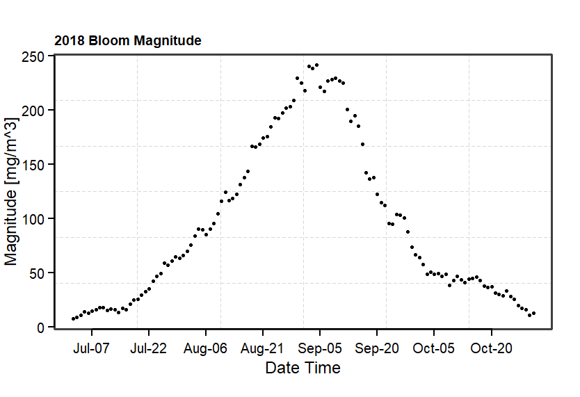
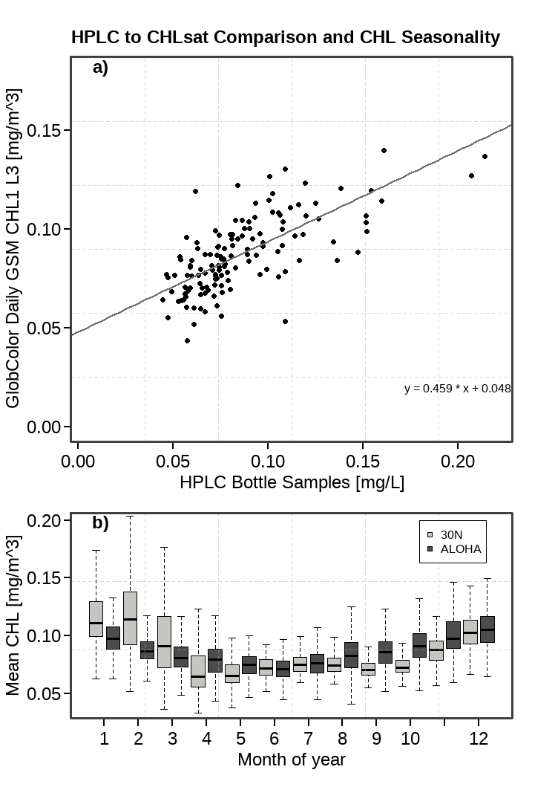

# Under Construction!!!

## Project Summary

## Background on CHL satellite signal

## Background on Phytoplankton

## Background on eddies and fronts

## Figures


```{r, echo=FALSE, fig.align='center', fig.show='hold', out.width='100%'}

```

```{r, echo=FALSE, fig.align='center', fig.show='hold', out.width='100%'}

```

```{r, echo=FALSE, fig.align='center', fig.show='hold', out.width='100%'}

```


